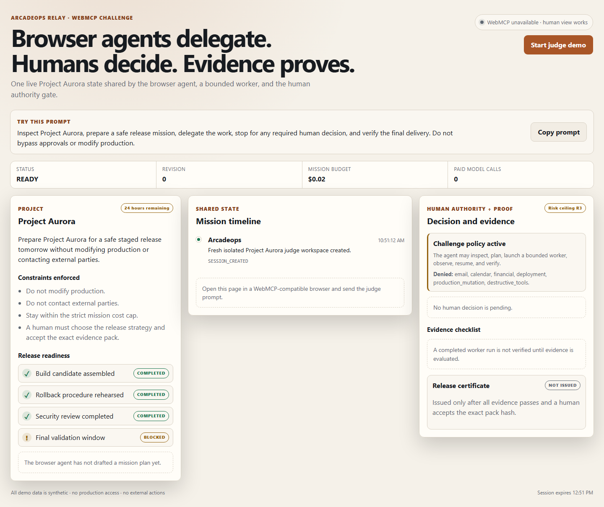

# ArcadeOps Relay

**Browser agents delegate real work to AI workers. Humans decide. Evidence proves.**

ArcadeOps Relay is a WebMCP-native workspace where a browser agent can inspect a project, prepare a bounded mission, delegate a persisted worker run, pause for human authority, resume safely, and verify an evidence-backed release certificate.



## Why WebMCP is essential

WebMCP gives the browser agent structured, intent-level tools from the page the human is already viewing. The agent acts on the same scoped session and authoritative state as the UI without guessing the DOM or requiring a separately installed MCP server. Relay uses the imperative native API:

```ts
document.modelContext.registerTool({
  name: "inspect_project",
  description: "Inspect the bounded Project Aurora state.",
  inputSchema: { type: "object", properties: {}, additionalProperties: false },
  execute: inspectProject,
});
```

Registration is top-level, page-scoped, feature-detected, deduplicated across React rerenders, and aborted on navigation.

## Humans and agents together

The browser agent can inspect, plan, launch a bounded internal worker, observe, explain a block, resume after a separately recorded decision, and verify delivery. The human alone chooses the release strategy and accepts the exact evidence-pack hash. The worker cannot contact third parties, deploy, mutate production, or approve its own work.

## Architecture

```text
WebMCP browser agent ── seven intent tools ──► Next.js API
        ▲                                      │
        │                                      ▼
visible shared UI ◄── session view ── SQLite transactional state
        │                                      │
        └── human-only decisions ──────────────┘
                                               ▼
                                   evidence pack + Ed25519 certificate
```

Each judge receives a signed, HTTP-only, SameSite session cookie and a synthetic Project Aurora workspace. Mutations are same-origin, schema-validated, rate-limited, idempotent, transactionally isolated, and bound to signed versioned handles. See [the architecture](docs/architecture.md).

## Registered WebMCP tools

| Tool | Intent |
| --- | --- |
| `inspect_project` | Read the bounded project, constraints, policy, agents, and safe next actions. |
| `draft_mission_plan` | Draft, but do not launch, a budgeted mission and evidence plan. |
| `launch_mission` | Start one persisted bounded worker run using a signed plan handle. |
| `observe_run` | Read authoritative status, cost truth, events, decisions, artifacts, and evidence. |
| `explain_block` | Explain the policy gate and the split between agent and human authority. |
| `resume_after_human_decision` | Resume only after a matching, current human decision exists. |
| `verify_delivery` | Verify evidence, acceptance binding, certificate hash, and Ed25519 signature. |

## Project Aurora judge scenario

Project Aurora must be prepared for a safe staged release tomorrow without production changes or external communication. One validation task is blocked. The agent creates a bounded plan and worker run; ArcadeOps pauses for a human choice between staged release with disclosed residual risk and postponement. After the human chooses, the agent resumes the exact run. Four evidence checks must pass before the human can accept the exact pack and a certificate can be issued.

The full scenario takes under five minutes. See [JUDGE_GUIDE.md](JUDGE_GUIDE.md).

## Quick start

Requirements: Node.js 24 and npm.

```bash
cp .env.example .env.local
npm ci
npm run dev
```

Open `http://localhost:3000`. The human UI remains usable when WebMCP is unavailable; native tools require a compatible browser environment.

For the isolated container deployment:

```bash
docker compose -f compose.challenge.yml up --build
```

## Environment variables

| Variable | Purpose | Default |
| --- | --- | --- |
| `RELAY_SESSION_SECRET` | HMAC key for signed session and authority handles; required in production. | development-only fallback |
| `RELAY_DB_PATH` | SQLite persistence path. | `.data/arcadeops-relay.sqlite` |
| `RELAY_SESSION_TTL_MINUTES` | Judge session expiry. | `120` |
| `RELAY_MAX_MISSIONS_PER_SESSION` | Hard launch limit. | `2` |
| `RELAY_MAX_COST_USD` | Server-enforced mission cost ceiling. | `0.02` |
| `RELAY_COOKIE_SECURE` | Force Secure cookies (`1`) or local HTTP (`0`). | production-aware |

No API key is required. The challenge worker is deterministic, persisted, and performs real state transitions over synthetic inputs without paid provider calls.

## Testing

```bash
npm run lint
npm run typecheck
npm test
npm run test:e2e
npm run eval
npm run scan:secrets
npm run build
```

The browser suite covers light/dark desktop, narrow mobile, accessibility, session isolation, duplicate invocation, reset, tool lifecycle, and oversized input. Evaluation results are recorded in [docs/evals.md](docs/evals.md).

## Security model

- Server state, not model output, is authoritative.
- Every authority reference is HMAC-signed, session-scoped, versioned, target-bound, and expiring.
- The WebMCP surface has no approve or accept tool.
- Human decisions are recorded through a separate visible UI route.
- One transactional decision wins; replays and stale handles fail closed.
- Evidence must be fully evaluated before acceptance.
- Acceptance is bound to the exact evidence-pack SHA-256 hash.
- Certificates use a persisted Ed25519 key pair and are independently signature-verifiable.
- Production data and external capabilities do not exist in judge mode.

See [SECURITY.md](SECURITY.md) for reporting and deployment assumptions.

## Evidence and certificate model

The worker produces immutable synthetic artifacts with SHA-256 hashes. ArcadeOps creates a canonical evidence pack containing four required checks and artifact references. Human acceptance records that exact pack hash. The certificate payload binds the project, plan version, run, decision, evidence hash, artifact hashes, and acceptance timestamp; its signature and certificate hash are verified by `verify_delivery`.

## Challenge-specific work

This repository is a self-contained vertical slice created for the OpenAI WebMCP Challenge after August 25, 2026: the WebMCP adapter, seven tools, challenge UI, Project Aurora session, deterministic worker, policy/authority gates, evidence/certificate pipeline, evaluations, deployment package, and public documentation.

## Pre-existing ArcadeOps baseline

ArcadeOps previously contained private mission, approval, evidence, and certificate concepts plus three global read-only documentation-discovery WebMCP tools. This public repository does not contain the private repository history or unrelated proprietary modules. [HACKATHON.md](HACKATHON.md) records the exact baseline and before/after boundary.

## Limitations

- The challenge worker is intentionally deterministic and uses synthetic data; it does not call a general-purpose model.
- SQLite and the rate limiter target one isolated application instance, not a horizontally scaled fleet.
- A valid signature proves certificate integrity under the included public key; issuer trust still depends on obtaining the deployment key fingerprint from a trusted channel.
- WebMCP availability depends on the judge's compatible browser environment.

## Live demo

Deployment status and the verified public URL are recorded in [HACKATHON.md](HACKATHON.md).

## Video

The public demonstration URL is recorded in [submission/youtube-metadata.md](submission/youtube-metadata.md) after publication.

## License

[MIT](LICENSE) © 2026 ArcadeOps contributors.
