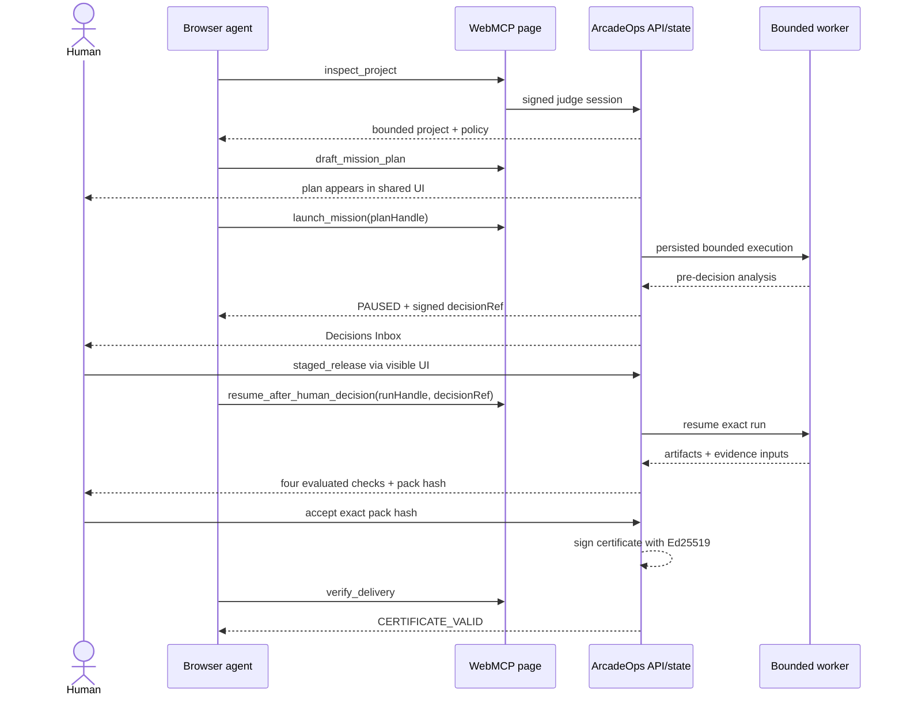

# Architecture

## Components and trust boundaries

| Component | Authority | Inputs | Enforced controls |
| --- | --- | --- | --- |
| WebMCP adapter | Seven product-intent tools | Strict JSON schemas | Page scope, feature detection, one registration owner set, abort on leave |
| Next.js routes | Public judge-session API | Cookie, origin headers, bounded JSON | Signed session, same origin, rate limits, Zod strict parsing |
| Mission engine | Session-local state transitions | Parsed tool/human intent | Signed target handles, idempotency, risk/cost/launch gates |
| SQLite store | Authoritative state | Internal structured state | Prepared queries, transactions, optimistic revision check |
| Deterministic worker | Synthetic Aurora release analysis | Seed project and approved decision | Internal allowlist, no network/process/provider capability |
| Human UI | Decision and evidence acceptance | Current signed decision/acceptance reference | Separate non-WebMCP endpoint, exact version/hash binding |
| Proof pipeline | Evidence pack and certificate | Canonical artifacts/state | SHA-256, all-checks-pass gate, Ed25519 signature |

## End-to-end sequence



## State machine

```text
READY
  └─ draft ─► PLAN_DRAFTED
                 └─ launch ─► AWAITING_HUMAN_DECISION
                                  ├─ postpone ─► DECISION_RECORDED / resume refused
                                  └─ staged release ─► DECISION_RECORDED
                                                           └─ resume ─► READY_FOR_ACCEPTANCE
                                                                              └─ exact human acceptance ─► ACCEPTED
```

The server returns the current state for safe repeated calls. A model statement cannot advance this machine.

## Session and isolation

`GET /api/session` creates a fresh workspace when no valid cookie exists. The cookie contains a signed handle, not a database credential. Only its decoded, signature-verified session ID is used in a prepared SQLite lookup. Expired state is inaccessible. Reset deletes the current row and creates a new session.

Raw IDs for the session are excluded from the browser session view. Public plan/run/decision/acceptance references are signed handles scoped to one session and one exact version or hash.

## Cost and capabilities

The deterministic worker records a complete cost truth of `$0.004` and calls no paid provider. The server cost cap defaults to `$0.02` and a session can launch at most two missions (the current scenario state itself permits only one unique run). The allowlist contains only internal release analysis and evidence evaluation; denied capabilities are not merely hidden from the UI—they have no implementation in this application.

## Evidence and certificate

Artifacts are hashed independently. The evidence pack is a canonical JSON object whose SHA-256 hash includes the run, decision, required checks, and artifact hashes. Acceptance stores only the current exact pack hash. The certificate then signs a canonical payload containing project/run/plan/decision/evidence/acceptance facts. Verification recomputes the certificate hash and validates the Ed25519 signature.
